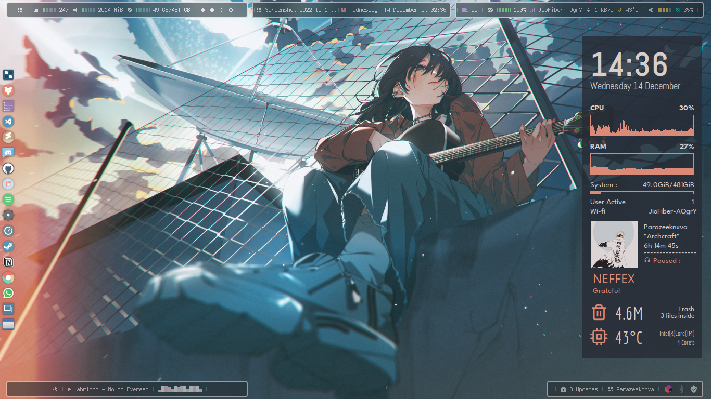
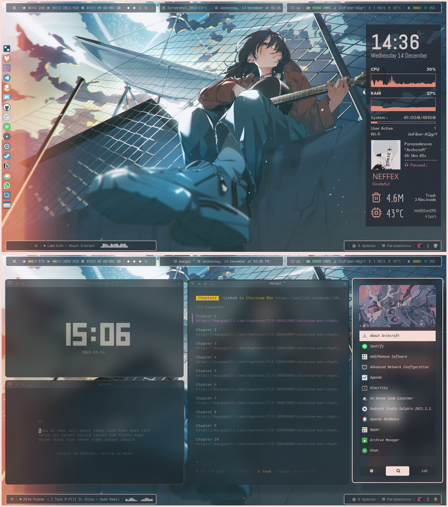

<h1 align="center"> Pistachio Dotfiles 🍚 :</h1>

> ✨ Inspired/fork/edit from ***Bitwise-forest*** theme by [***adi1090x***](https://github.com/adi1090x) from his Arch distro [***Archcraft-os***](https://github.com/archcraft-os/archcraft).
- 💻 Linux Configuration by [*parazeeknova*](https://github.com/parazeeknova).
- 📌 Posted on [*r/unixporn*](https://www.reddit.com/r/unixporn/comments/zlmtu3/openbox_finally_figured_out_how_to_enable_blur_in/?utm_source=share&utm_medium=web2x&context=3).

 Screenshot 🎞️ 

---

## 🌏 Overview :

- **Operating System** : [`Archcraft`](https://archcraft.io/)
- **Window Manager** : [`Openbox`](http://openbox.org/wiki/Main_Page)
- **Status Bar** : [`Polybar`](https://github.com/polybar/polybar)
- **Widgets** : [`Conky`](https://github.com/brndnmtthws/conky)
- **Launcher** : [`Rofi`](https://github.com/davatorium/rofi)
- **Session Manager** : [`SDDM`](https://wiki.archlinux.org/title/SDDM)
- **Notifications** : [`Dunst`](https://github.com/dunst-project/dunst)
- **Terminal** : [`Alacritty`](https://github.com/alacritty/alacritty)
- **File Manager** : [`Thunar`](https://wiki.archlinux.org/title/thunar) [`Ranger`](https://github.com/ranger/ranger)
- **Compositor** : [`Picom`](https://aur.archlinux.org/packages/picom-ibhagwan-git) 

## 🪜 Installation : 
- **Get the files from** : Here (Soon)
- If you are using _`Archcraft`_ as your OS, You can just replace openbox folder from the dotfile.  
( ***NOTE-FOR-ARCHCRAFT-USER'S*** : This Openbox config only contains Bitwise-forest theme. First ***BACKUP*** your default config to a seperate folder .)
- Install the following programs on your computer: [`cava`](https://github.com/karlstav/cava) [`Zafiro`](https://www.gnome-look.org/p/1209330) [`Phinger-cursors`](https://github.com/phisch/phinger-cursors) 
- After installing programs above, Create openbox directory in **`~/.config`** : `mkdir -p ~/.config/openbox`
- Copy Entire _`openbox`_ to **`~/.config/`** 
- Copy Everything from _`polybar-scripts`_ to **`Home-dir`**
- Copy Everything from _`fonts`_ to **`~/.local/share/fonts/`** 
- Copy Everything from _`conky`_ to **`~/.config/conky/`** 
- Logout and login to your amazingly configured Openbox WM.

---

## 🤖 [Reddit Post](https://www.reddit.com/r/unixporn/comments/zlmtu3/openbox_finally_figured_out_how_to_enable_blur_in/?utm_source=share&utm_medium=web2x&context=3) :

 Reddit post ([OPENBOX] Finally figured out how to enable blur in rofi :)) 🎞️ 

---
| Rofi | Desktop | Terminal | Conky |
| --- | --- | --- | --- |
|||||
---
## 🧩 Additional / CLI tools used :
- [***Mangal***](https://github.com/metafates/mangal) ~ My Favourite manga cli 
- [***Typioca***](https://github.com/bloznelis/typioca) ~ Typing Test 
---
## 🌟 Credits : 
- [***adi1090x***](https://github.com/adi1090x) ~ For his amazing minimal distro and themes and preconfigured openbox WM -  [***Archcraft-os***](https://github.com/archcraft-os).
- [***closebox73x***](https://www.gnome-look.org/u/closebox73x) ~ For his conky themes. 
- [***Polybar-scripts***](https://github.com/polybar/polybar-scripts) ~ For info-cava module. 
